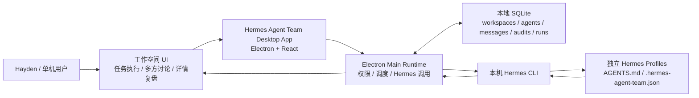
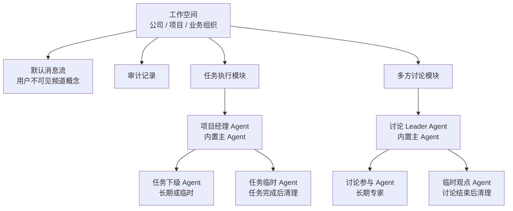
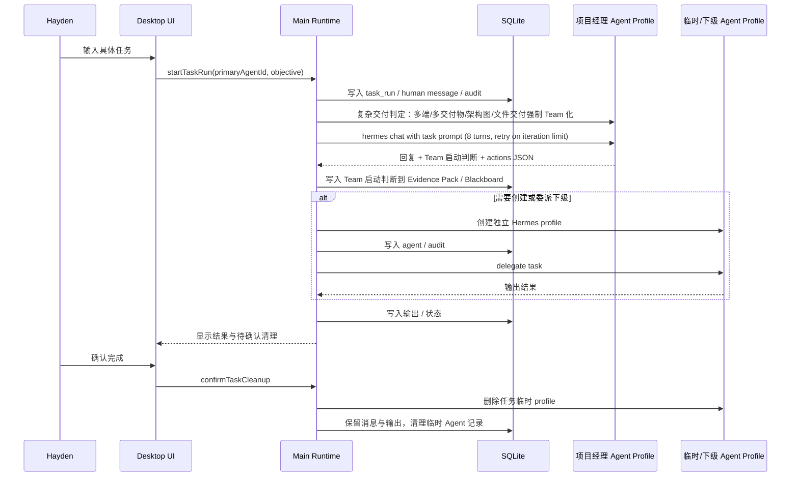
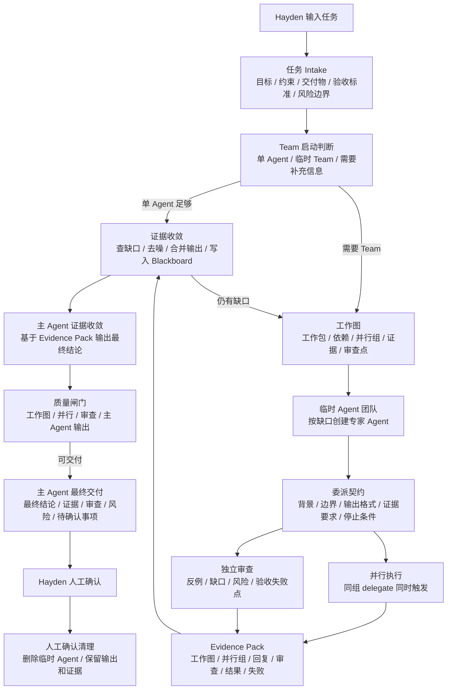
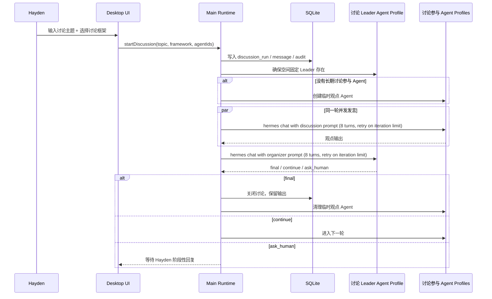
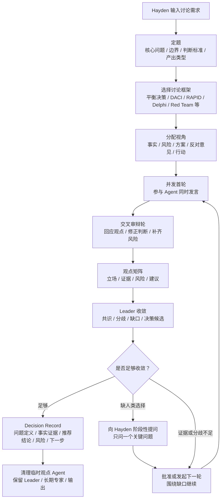
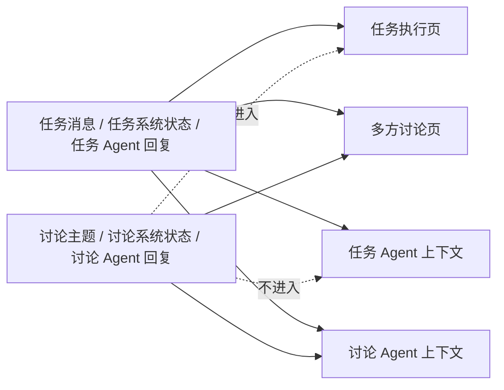
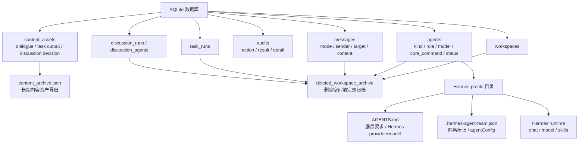
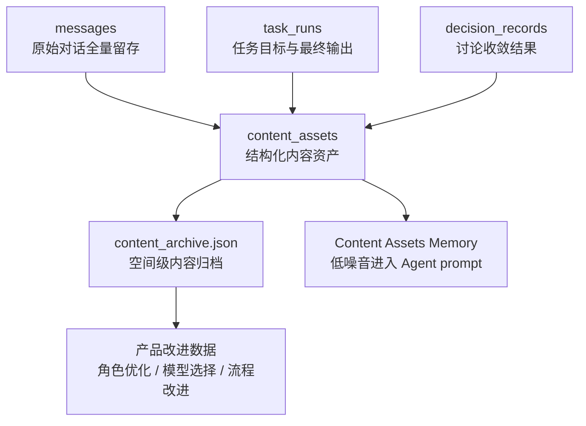
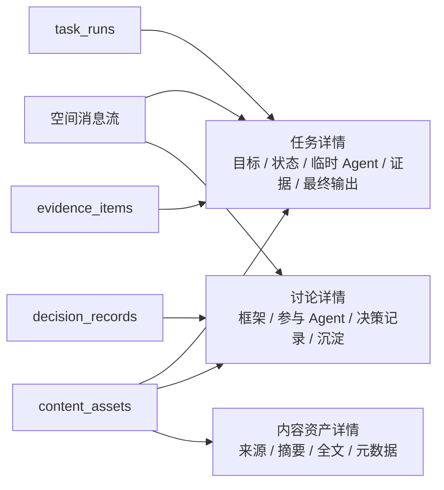

# Hermes Agent Team Architecture

更新时间：2026-06-26

## 1. 第一性原理

- 人只管理空间和关键意图，不直接管理所有 Agent。
- 工作空间是组织边界；任务执行和多方讨论是同一空间内的两种工作形态。
- 首次打开是空工作台，不自动创建默认工作空间。
- 每个 Agent 必须是独立 Hermes profile，而不是共享一个身份。
- 任务执行需要层级和交付闭环；多方讨论需要框架、轮次和收敛机制。
- 多 Agent 协作优先采用最小可行 Team：少 Agent、高约束、强验证，而不是默认扩编。
- Blackboard 必须是结构化共享状态，区分 facts、assumptions、decisions、risks、open_questions、locks、outputs。
- 任务 Agent 不能被讨论噪音污染；讨论 Agent 可以读取任务上下文用于评估。
- 所有关键动作必须能审计、能复盘、能清理。
- 对话和输出是长期资产；原始内容要完整保留，关键内容要结构化沉淀，并能追溯来源。
- 删除工作空间不是删除资产：空间和 Agent 可以从当前工作台清掉，但任务、讨论、消息、证据、决策和内容资产必须先进入删除归档。

## 2. 当前总架构

协作运行协议见 `OPERATING_PROTOCOL.md`，Blackboard 结构化状态规范见 `BLACKBOARD_SCHEMA.md`。

## 3. 工作空间内结构

## 4. 任务执行流

## 4.1 任务项目经理组织临时 Agent 的系统框架

任务执行的第一性原理：用户要的是可验收交付，不是更多对话。项目经理 Agent 的核心职责是把人的任务转成可交付工作系统，并用临时 Agent 扩展能力和并行度。Team 的标准形态是并行执行 + 独立审查 + 证据收敛 + 主 Agent 负责制。

项目经理 Agent 的工作协议：

- 任务接收：先复述目标、约束、交付物、验收标准和风险边界。
- Team 启动判断：先做轻重分流，简单任务默认单 Agent；只有能力缺口、并行验证、独立审查或长周期拆分时才启动临时 Team。
- ROI 判断：创建临时 Agent 前，显式考虑冷启动、Token、合并成本和本地写入冲突风险。
- 工作图：复杂任务必须记录工作包、依赖、并行组、证据要求、审查点和最终负责人。
- 临时 Agent 组建：只有缺少能力、需要并行验证或需要专门审查时才创建临时 Agent。
- 委派契约：每个委派必须写清背景、边界、输出格式、验收标准、证据要求和停止条件。
- 并行执行：同一 `parallel_group` 下的互不依赖工作包由主进程并行触发，不再按聊天顺序串行等待。
- 独立审查：非简单 Team 任务必须设置审查或 Red Team 工作包，审查者要找证据缺口、反例、风险和验收失败点。
- 证据收敛：项目经理用 Evidence Pack 和 Blackboard 检查下级输出，不把未验证观点直接交付给人。
- 主 Agent 负责制：Team 执行后系统会触发主 Agent 证据收敛回合，`primary_synthesis_result` 才是任务最终输出来源。
- 质量闸门：任务完成前必须记录 `quality_gate`，检查是否有工作图、并行委派、独立审查和主 Agent 输出。
- 最终交付：只向 Hayden 汇报最终结论、可用结果、关键证据、审查结果、风险和需要确认的事项。
- 清理：人确认完成后，系统删除临时 Agent，只保留工作输出、证据和审计记录。

临时 Agent 的边界：

- 只属于本次任务。
- 默认不常驻。
- 不参与多方讨论。
- 不直接回复 Hayden，除非它本身就是人的直接主 Agent。
- 交付物必须能被项目经理整合进最终结果。

## 5. 多方讨论流

## 5.1 讨论 Leader 组织 Agent 讨论的系统框架

讨论的第一性原理：用户要的是更好的判断，不是无限轮对话。单轮讨论只能得到独立观点，不能完成观点之间的反驳、修正和收敛。因此默认讨论至少包含两轮：第 1 轮独立判断，第 2 轮交叉审辩；第 3 轮以后只围绕重大分歧、证据缺口或风险缺口继续。讨论 Leader Agent 的核心职责是把人的讨论需求转成结构化议题，调动不同视角，并把讨论收敛成 Decision Record。

讨论 Leader Agent 的工作协议：

- 定题：把用户话题转成核心问题、讨论边界、判断标准和需要产出的结论类型。
- 选框架：按用户选择的讨论框架组织发言，而不是泛泛聊天。
- 分角色：把参与 Agent 分配到不同专业视角或立场，Leader 不作为普通观点 Agent 发言。
- 并发首轮：同一轮参与 Agent 同时开始，避免串行污染第一判断。
- 共享阅读：讨论 Agent 可以读取任务内容、任务证据和前面讨论发言。
- 最低审辩轮次：默认至少 2 轮；第 1 轮独立判断，第 2 轮交叉审辩。低于 2 轮时 Leader 不能最终收敛，系统会自动续轮。
- 收敛：每轮后整理观点矩阵、共识、分歧、证据、风险和缺口。
- 续轮：第 3 轮以后只有重大分歧、证据不足、风险未澄清或框架需要时才继续下一轮，硬上限 4 轮。
- 人工介入：需要 Hayden 选择方向、补充约束或批准继续时，只问一个清晰问题。
- 最终输出：形成 Decision Record，而不是只发一段总结。
- 清理：讨论结束后清理本轮临时观点 Agent，长期专家和讨论 Leader 保留。

讨论参与 Agent 的边界：

- 只表达自己的独立视角。
- 可以看任务内容和讨论历史。
- 不能创建任务 Agent。
- 不能删除任务 Agent。
- 不能决定是否继续下一轮。
- 输出必须可被 Leader 放入观点矩阵。

## 6. 可见性与上下文边界

## 7. 数据与 profile 边界

## 8. 内容资产沉淀层

内容保存的第一性原理：消息流是事实记录，内容资产是可复用知识。二者不能混为一谈。

当前保存策略：

- `messages`：保留原始人类发言、Agent 回复和系统状态，用于完整追溯。
- `content_assets`：保存可复用内容资产，包含来源、类型、作用域、标题、摘要、全文、作者和重要性。
- `content_archive.json`：按工作空间导出长期内容归档，供后续复盘和产品/Agent 优化使用。
- 任务 Agent 只读取任务/非讨论资产。
- 讨论 Agent 可以读取任务资产和讨论资产。

当前沉淀类型：

- `human_task_request`：人的任务需求。
- `task_agent_output`：任务 Agent 输出。
- `task_final_output`：任务最终交付。
- `human_discussion_topic`：人的讨论主题。
- `discussion_agent_output`：讨论 Agent 观点。
- `discussion_decision`：讨论 Leader 收敛后的决策记录。

关键约束：

- 内容资产必须能追溯到 `source_type + source_id`。
- 临时 Agent 可以删除，但它的输出资产必须保留。
- 任务页面不能读取讨论资产。
- 讨论页面可以读取任务资产，用于更好地评估。
- 资产摘要可以进入 Agent prompt，原始全文留在归档里，避免上下文膨胀。

## 9. 详情复盘视图

详情视图的第一性原理：聊天流适合沟通，但不适合审检。任务、讨论和内容资产必须能从消息流进入结构化详情，才能复盘协作质量和沉淀价值。

当前详情能力：

- 任务详情：从任务运行条进入，查看任务目标、项目经理、状态、临时 Agent、最终输出、Evidence Pack 和任务沉淀资产。
- 讨论详情：从讨论状态条进入，查看讨论主题、讨论框架、组织 Agent、参与 Agent、Decision Record 和讨论沉淀资产。
- 内容资产详情：从右侧 Content Assets 进入，查看资产来源、范围、作者、重要性、摘要、全文和结构化元数据。
- 详情弹层独立滚动，不挤压主界面输入区。

## 10. 当前已经稳定的能力

- 未创建工作空间时没有默认空间，也没有空间主 Agent。
- 创建工作空间时自动创建任务项目经理 Agent 和讨论 Leader Agent。
- 每个 Agent 对应独立 Hermes profile。
- Agent 卡片可编辑底层要求和 Hermes provider/model；模型候选来自本机 Hermes 配置与 provider 模型缓存，并同步 profile 标记与 `AGENTS.md`。
- Data Governance v0.6 在启动时检查 SQLite 与 Hermes profile 的一致性：外键异常、孤儿 DB 行、缺失 profile 的 Agent、孤儿 HAT profile 和 released/stale lock 堆积。
- 数据治理默认只报告和审计；修复必须由人显式触发。
- `修复DB` 先备份 `team.sqlite`，再清理孤儿行和非活跃历史锁。
- `归档profile` 只处理 Hermes Agent Team 托管的孤儿 profile，先复制到 `data_governance/profile_archive/` 再删除原目录。
- 任务执行和多方讨论使用两个独立 Agent 池。
- 任务页不显示讨论内容；讨论页可以显示任务内容。
- 任务临时 Agent 在人确认后清理，只保留输出。
- 讨论 Leader 常驻；讨论临时观点 Agent 在讨论结束后清理。
- 内容资产基础设施：SQLite `content_assets`、`content_archive.json`、Content Assets Memory。
- 任务详情、讨论详情和内容资产详情第一版。
- 斜杠命令支持 `/help`、`/status`、`/stop`、`/start`、`/round`、`/new`、`/model`。
- 完整验收覆盖 mock 和真实 Hermes profile 创建、回复、配置更新、清理。

## 11. 当前最大架构缺口

### 11.1 共享状态空间已补第一版，但还缺可治理状态

第一版已补：

- SQLite `blackboard_entries` 作为权威共享状态。
- 每个工作空间导出只读 `team_state.json` 快照。
- Agent prompt 读取压缩 Blackboard。

仍缺：

- 状态项的置信度、过期策略、来源证据引用。
- 状态归档和人工修正界面。
- 对不同 Agent 的状态可见权限。

### 11.2 Evidence Pack 已补第一版，但还缺真实执行细节

第一版已补：

- 任务启动、Agent 回复、创建/删除 Agent、委派、任务结果、停止、清理都会写入 Evidence Pack。
- Agent 回复证据会记录 Hermes profile、provider/model、耗时、退出状态、脱敏命令、提示哈希和输出摘要。
- 讨论 Agent 可以读取任务 Evidence Pack 摘要。
- 右侧协作状态面板可查看最近证据。

仍缺：

- Hermes 以外的真实工具命令、文件改动、测试结果和错误片段。
- 证据和具体输出文件的引用。
- 敏感信息过滤。
- 任务详情里还缺可展开的真实执行证据链。

### 11.3 Decision Record 已补第一版，但还缺结构化字段

第一版已补：

- 讨论 Leader Agent 每轮组织输出会写入 Decision Record。
- 记录框架、状态、摘要、决策、下一步动作、是否需要人确认。
- 最新 Decision Record 会进入 Blackboard。

仍缺：

- 背景、分歧、共识、风险、反对意见、置信度拆分字段。
- 从 Decision Record 到任务项目经理 Agent 的明确转交动作。
- 讨论详情里还缺按轮次展开和证据引用。

### 11.4 内容资产已补第一版，但还缺治理和检索

第一版已补：

- 人类任务/讨论主题、Agent 输出、任务最终交付、讨论决策都会写入 `content_assets`。
- 每个资产带 source、scope、summary、content、importance 和创建者。
- 每个工作空间导出 `content_archive.json`。
- Agent prompt 读取压缩后的 Content Assets Memory。

仍缺：

- 内容资产搜索、标签、收藏、废弃、合并和人工修正。
- 高质量/低质量输出的评分机制。
- 从内容资产反向优化 Agent profile 的闭环。
- 长期跨空间知识库。

### 11.5 缺动态专家库

目前讨论参与 Agent 需要手动或临时生成，缺少按任务类型自动生成专家角色：

- 安全审计。
- 架构审查。
- 测试 QA。
- 性能优化。
- 产品策略。
- 数据分析。

### 11.6 缺风险阻断与审批

现在 `/stop` 能停止运行，但缺少风险规则：

- 删除文件、执行破坏性命令、改配置、安装依赖等操作需要风险等级。
- 高风险操作应触发人工确认。
- 讨论 Agent 可以提出 `risk_block` 建议，但最终阻断应由系统规则和人确认共同决定。

## 12. 建议下一步路线

第一优先级：增强 `Evidence Pack`。

原因：任务详情已经能展示第一版证据，下一步要把真实命令、退出码、文件改动、测试结果和错误片段纳入证据链。

第二优先级：增强 `Decision Record`。

原因：讨论详情已经能展示第一版决策，下一步需要把背景、共识、分歧、反对意见、置信度和证据引用结构化。

第三优先级：做 `内容资产检索与治理`。

原因：内容资产详情已经能查看单个资产，下一步需要搜索、标签、评分、收藏、废弃和合并。

第四优先级：做 `动态专家库`。

原因：等任务证据和讨论决策更结构化后，再动态生成专家，专家才有足够上下文做出有深度的判断。

第五优先级：做 `风险审批和阻断`。

原因：这是安全层，应建立在任务证据链和状态系统之上，否则容易变成阻碍执行的硬拦截。
